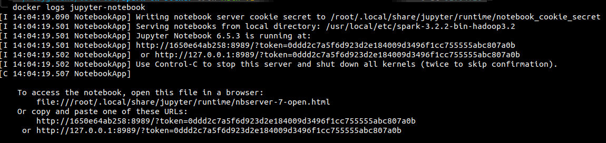
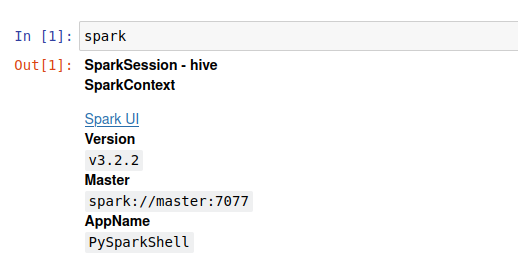
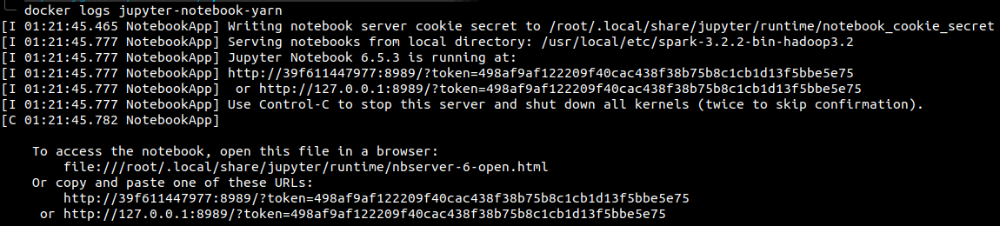
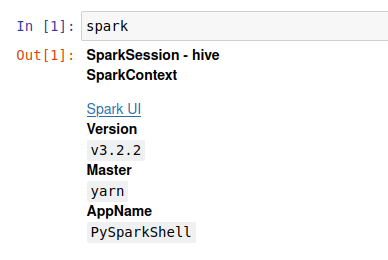

# Spark-On-Docker
Create a simple spark cluster using the docker container, you can use this with jupyter notebook.


## Deploy Method
1. [Spark Standalone](https://github.com/kowalskyyy999/Spark-On-Docker/tree/main/Standalone)
2. [YARN](https://github.com/kowalskyyy999/Spark-On-Docker/tree/main/Yarn)

## Prerequisite
First you must create **.env** file in parent directory and fill in accordance with the below
```shell
export SPARK_VERSION=
export SPARK_HADOOP_VERSION=
export HADOOP_VERSION=          # Optional if Deploy in YARN
```
For details **SPARK_VERSION** and **SPARK_HADOOP_VERSION** specific version you can visit in [here](https://archive.apache.org/dist/spark/)

### Note
For **HADOOP_VERSION** the version must be same with hadoop cluster version in [here](https://github.com/kowalskyyy999/Hadoop-On-Docker)

## How to use it
*****************************************************************
### Standalone Mode
1. Make sure **SPARK_VERSION** and **SPARK_HADOOP_VERSION** properly filled
2. Build the images
```shell
make standalone-up
```
3. Get url jupyter-notebook
```shell
docker logs jupyter-notebook
```


4. Copy the url and paste to your web browser

5. Jupyter notebook has already for to use



6. Stop/down spark cluster
```shell
make standalone-down
```

*****************************************************************
### YARN Mode
1. Make sure **SPARK_VERSION**, **SPARK_HADOOP_VERSION**, **HADOOP_VERSION** properly filled
2. **Important !** - Because yarn running on hadoop cluster too, make sure you have hadoop cluster already running, if you don't have, run the [hadoop cluster](https://github.com/kowalskyyy999/Hadoop-On-Docker) soon.
3. Build the images
```shell
make yarn-up
```
4. Get url jupyter-notebook
```shell
docker logs jupyter-notebook-yarn
```


5. Copy the url and paste to your web browser

6. Jupyter notebook has already for to use



7. Stop/down spark cluster
```shell
make yarn-down
```
*****************************************************************

## Reference
https://github.com/cluster-apps-on-docker/spark-standalone-cluster-on-docker